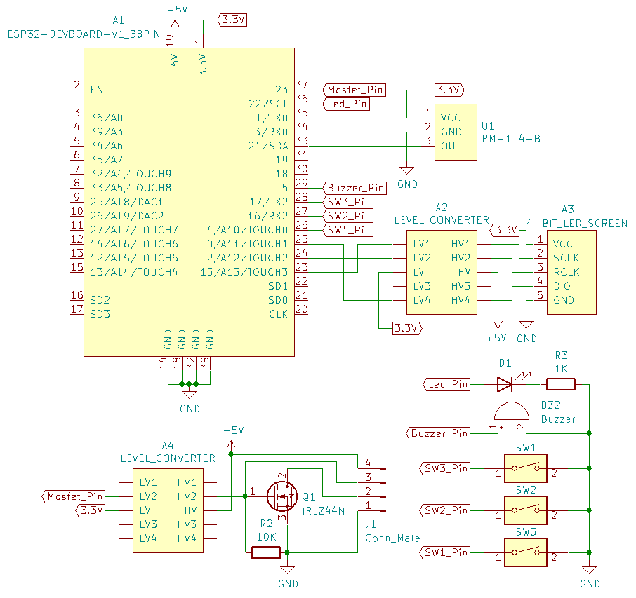
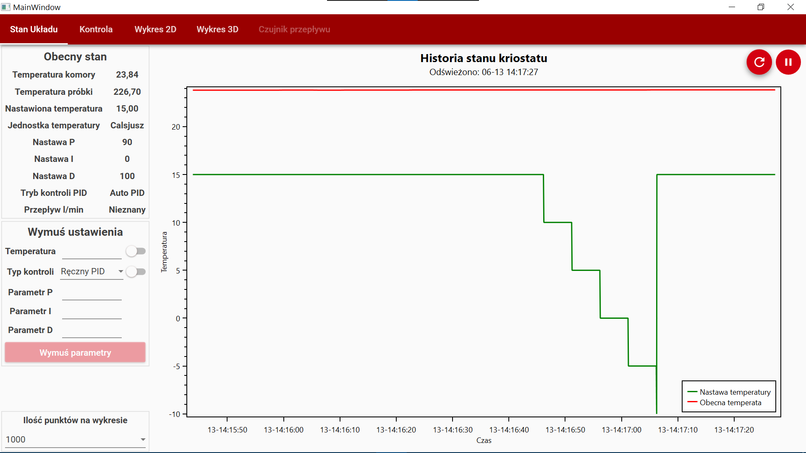
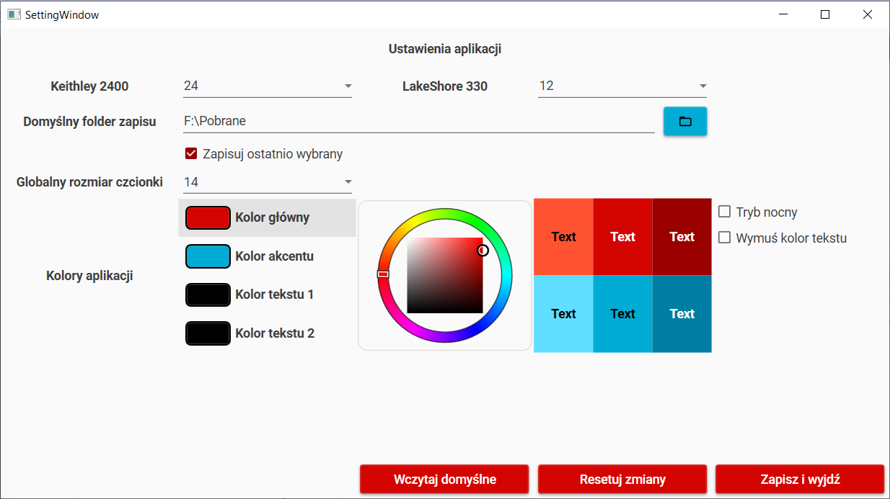
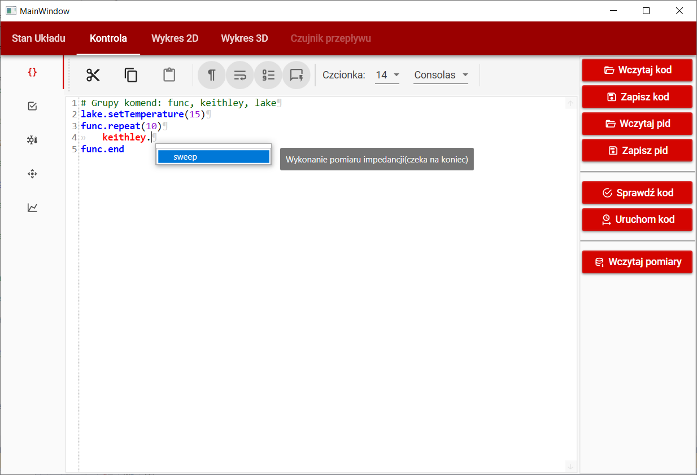
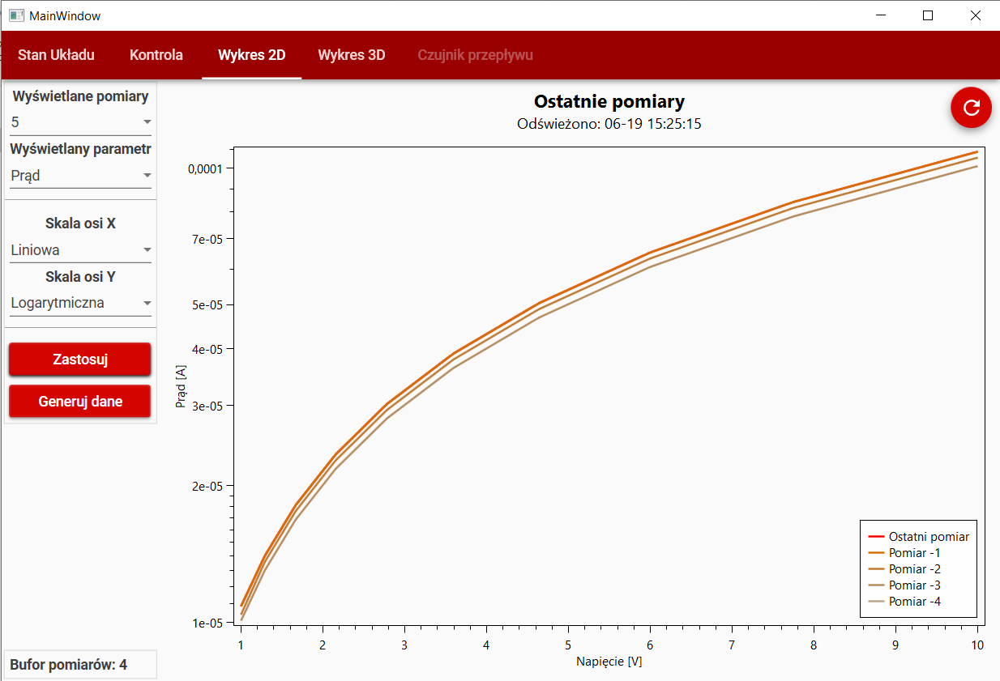
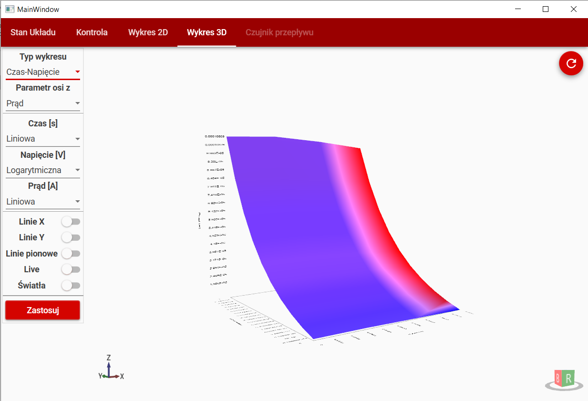
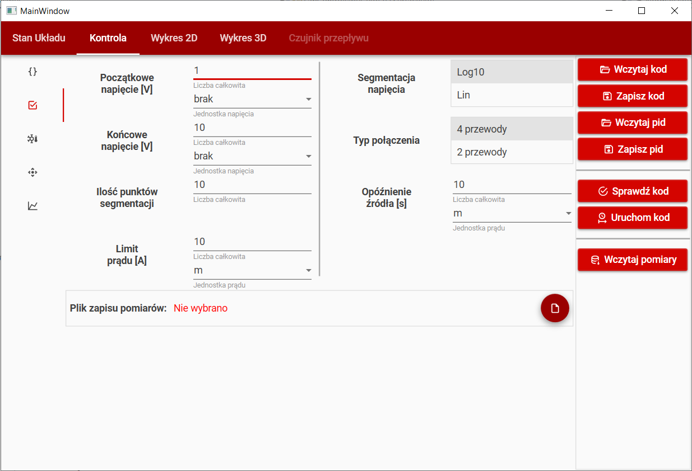
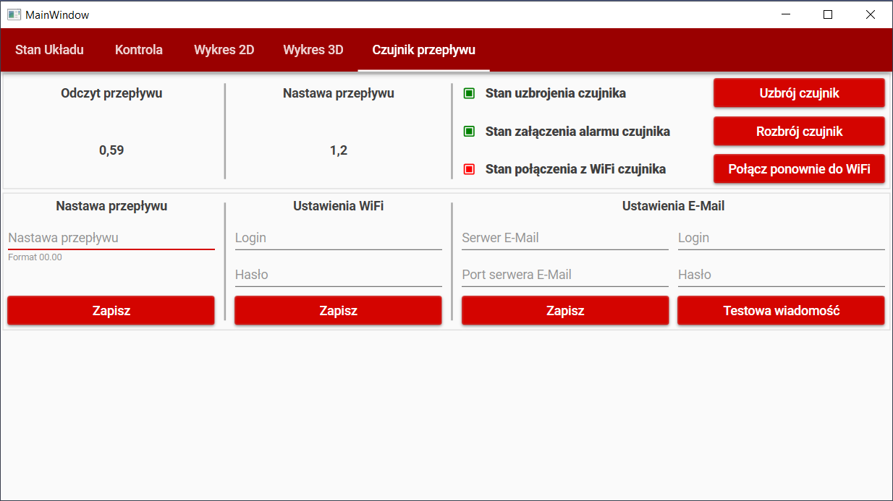
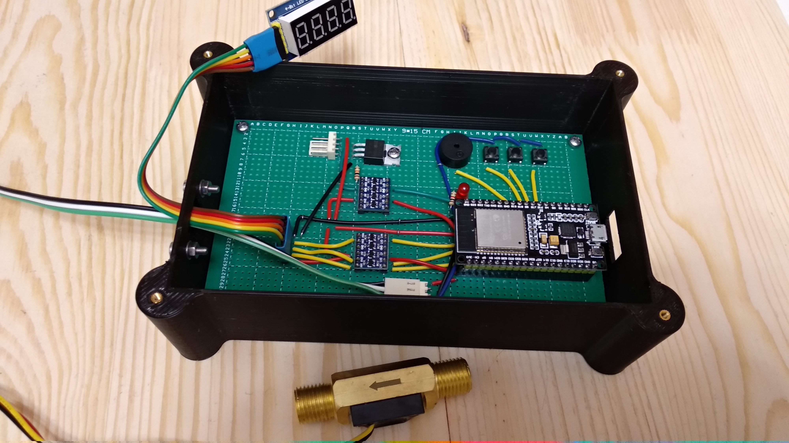
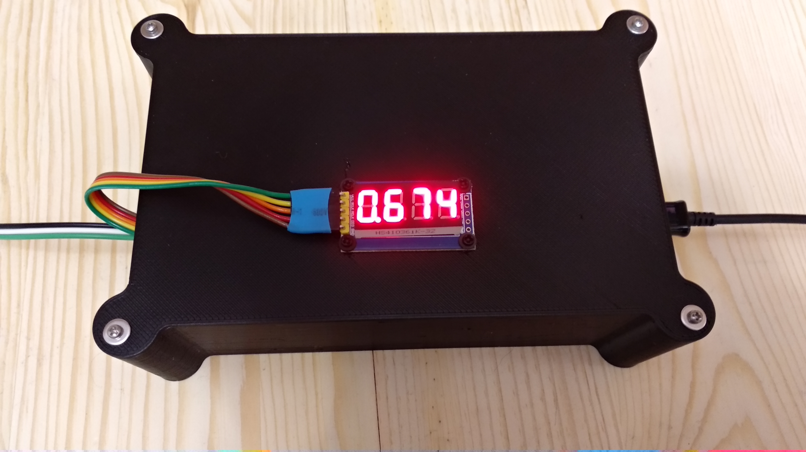

Automatyzacja układu pomiarowego.

Automatyzacja składa się z oprogramowania na komputer oraz czujnika przepływu wody chłodzącej kompresor. Czujnik odpowiada również za wysyłanie powiadomień e-mail o braku przepływu(wykorzystywany komputer z różnych przyczyn nie jest podpięty do internetu).

**Zawartość repozytorium:**
 - CAD - Modele elementów drukowanych w 3D na potrzeby czujnika
 - ESP32-FlowControl - Kod oprogramowania czujnika
 - Freezer - Kod źródłowy aplikacji
 - GpibCppController - Sterownik GPIB dla aplikacji napisany w C++

**Schemat czujnika:**

**Zrzuty ekranu aplikacji:**

**Zdjęcia czujnika:**

